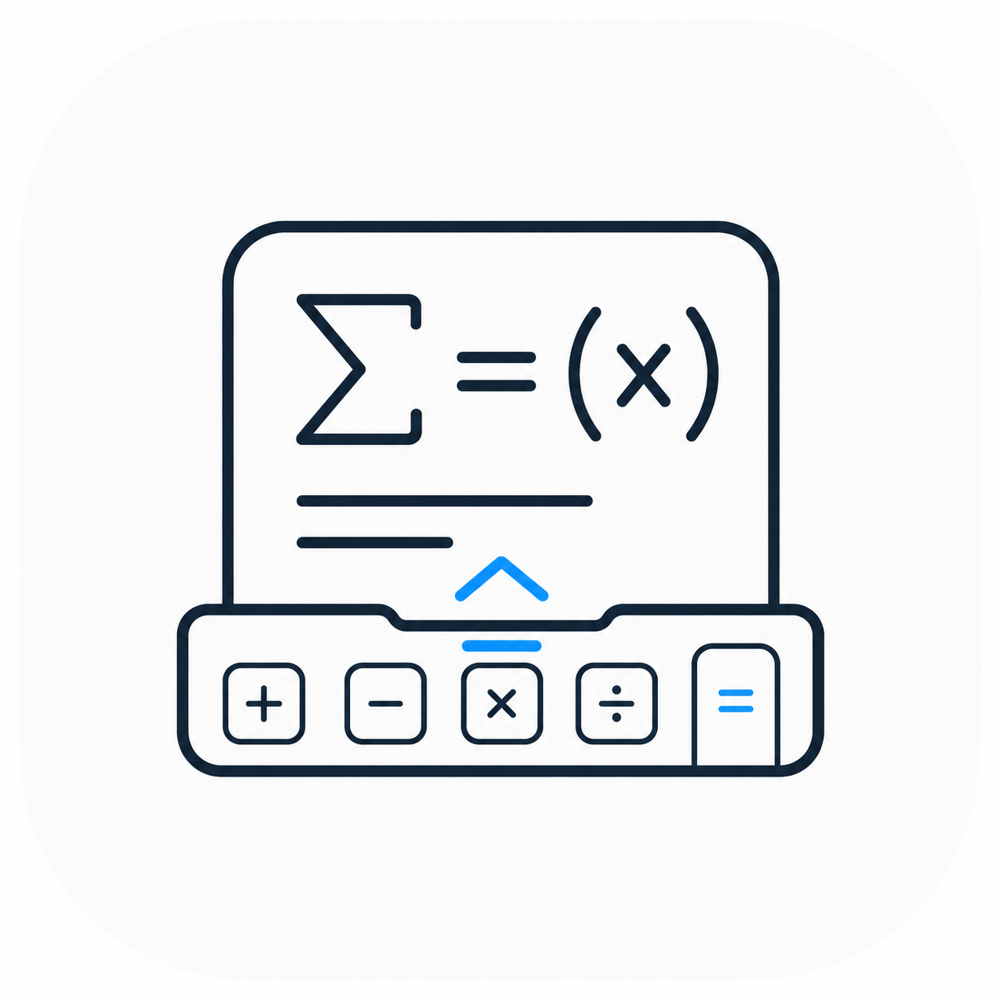
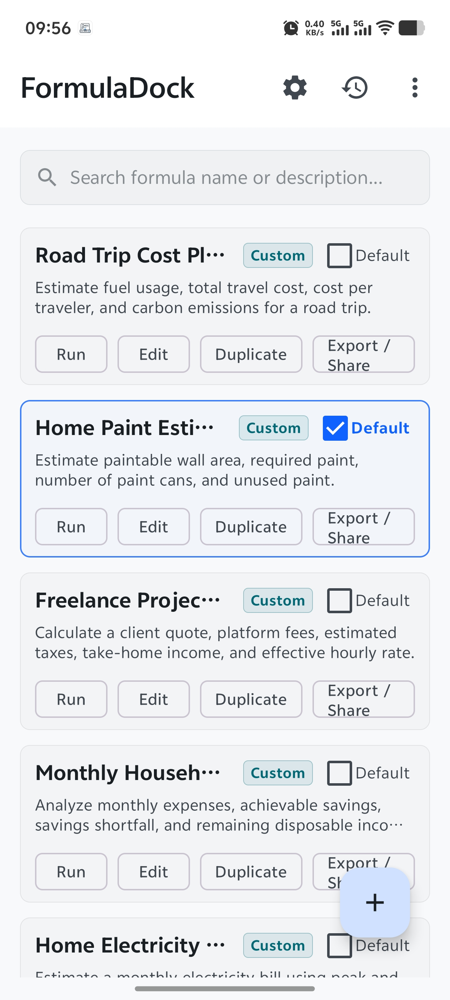
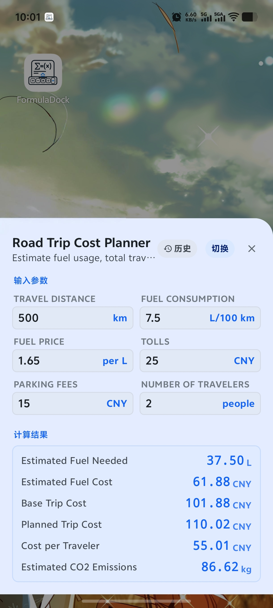
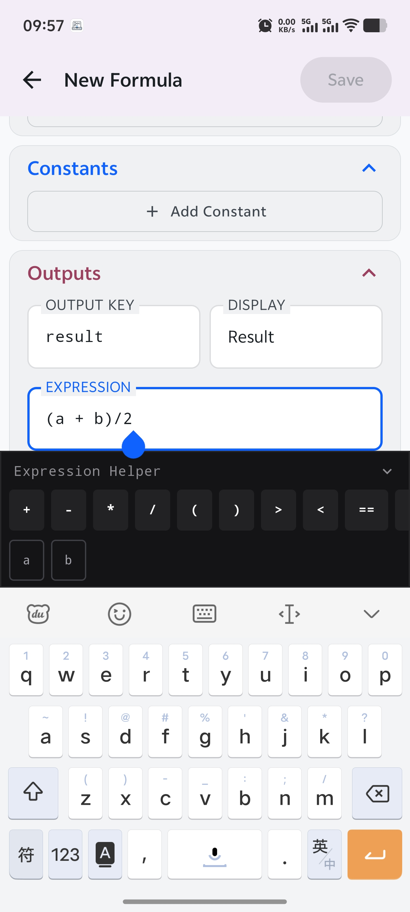
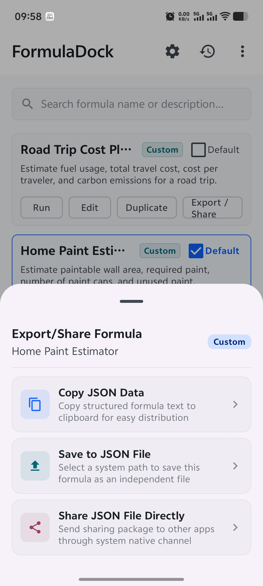
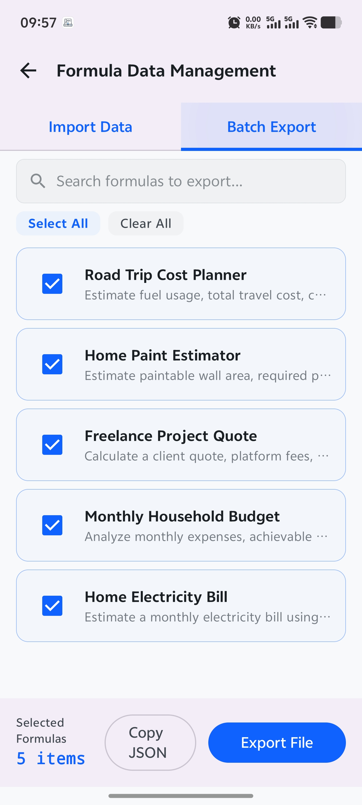
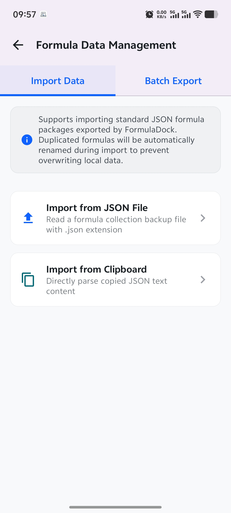
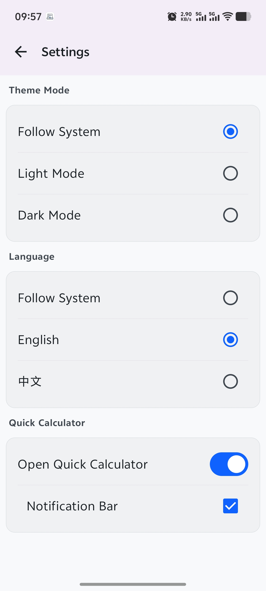

<div align="center">


# FormulaDock

**A cross-platform formula definition, management, and evaluation utility powered by Kotlin Multiplatform & Compose Multiplatform**

[](https://github.com/shdmfire/FormulaDock/releases/latest)
[](LICENSE)
[](https://github.com/shdmfire/FormulaDock/stargazers)
[](https://github.com/shdmfire/FormulaDock/releases)

[Download](https://github.com/shdmfire/FormulaDock/releases/latest) · [Issues](https://github.com/shdmfire/FormulaDock/issues)

**English** | **[中文](README_CN.md)**

</div>

---

<p align="center">
  
  
  
  
</p>
<p align="center">
  
  
  
  
</p>

# FormulaDock

FormulaDock is a cross-platform formula definition, management, and evaluation utility built with **Kotlin Multiplatform (KMP)** and **Compose Multiplatform**. It runs smoothly on Android and desktop environments (Windows, Linux), enabling users to freely construct and run mathematical and business formulas.

---

## 📖 Introduction

### What problem does it solve?
In daily life and work, we often deal with repetitive, multi-step calculation processes (e.g., splitting road trip costs, estimating home paint requirements, quoting freelance projects, estimating monthly household budgets, or calculating home electricity bills). Using standard calculators requires repeatedly entering inputs and manually calculating intermediate steps, which is error-prone and inefficient. Meanwhile, spreadsheets like Excel are often bloated and inconvenient for quick entry on mobile devices.

**FormulaDock perfectly solves this pain point** by offering:
1. **Instant Summoning (Top Highlight)**: Launch the **Quick Calculator Panel** directly from the **dropdown system notification center on Android**, or summon/hide it instantly using **global keyboard hotkeys on Windows** (even from the background).
2. **Define inputs once**: Specify custom keys, labels, default values, units, required flags, and sort order.
3. **Configure constants**: Define fixed parameters (e.g., fixed tax rates or conversion coefficients).
4. **Define outputs**: Use mathematical expressions to calculate results with specific formatting precision.
5. **Evaluate dynamically**: Fill in the inputs, and the application evaluates results in real-time, saving all data to the local **calculation history**.

---

### Key Features

1. **Custom Formula Editor**
   - Create and edit formulas, defining titles and descriptions.
   - Dynamically manage **Inputs**: Configure variables with keys, labels, default values, units, required flags, and display order.
   - Dynamically manage **Constants**: Define static constants with values and units.
   - Dynamically manage **Outputs**: Write mathematical evaluation expressions, setting display precision (decimal places), units, and display order.

2. **Formula Run Panel**
   - Automatically generates form inputs based on the formula's parameters.
   - Real-time expression evaluation (auto-recalculates all outputs as you type).
   - Pre-packaged with useful templates (Road Trip Cost Planner, Home Paint Estimator, Freelance Project Quote, Monthly Household Budget, Home Electricity Bill).

3. **Calculation History**
   - Automatically saves inputs and outputs for every calculation.
   - Review history records with detailed inputs and outputs sorted by calculation time.

4. **Formula Import/Export (I/O)**
   - Export custom formulas to JSON files or import them back using system-native file dialogs (via FileKit).

5. **System Integration & Quick Summon**
   - **Android Integration**: Run the application and quickly launch the **Quick Calculator Panel** via a persistent notification in the dropdown system notification center.
   - **Windows Integration**: Supports registering system-wide global hotkeys in Windows to quickly launch/summon or hide the **Quick Calculator Panel** from the background.
   - **System Tray**: Desktop application supports native system tray integration.

6. **Preferences & Localization**
   - Light and dark theme switching.
   - Multi-language support (i18n).

---

### Supported Platforms

| Platform | Support Status | Minimum/Recommended Requirements |
| :--- | :--- | :--- |
| **Android** | 🟢 Supported | Minimum **Android 7.0** (API 24) / Target API 36 / Compile API 37 |
| **Windows** | 🟢 Supported | Windows 10/11, packages native `.exe` and `.msi` installers |
| **Linux** | 🟡 Untested | Linux distributions, packages `.deb` installers (not yet physically tested) |
| **JVM/JDK** | 🟢 Supported | Requires **JDK 11** or higher runtime environment |

---

## 🛠 Tech Stack

Only technologies actually used in the project are listed below:

### Core Frameworks
* **Kotlin Multiplatform (KMP)** - Shared business logic and data module.
* **Compose Multiplatform (JetBrains)** - Shared declarative UI framework for Android and Desktop.
* **Gradle (Kotlin DSL)** - Build system and dependency management.

### Persistence & Storage
* **SQLDelight (2.3.2)** - Multiplatform SQLite persistence with type-safe query generation.
* **Multiplatform Settings (1.3.0)** - Multiplatform key-value settings storage (for user theme preferences, etc.).

### Calculation & Coroutines
* **Multiplatform Expressions Evaluator (2.0.0)** - Mathematical expression parsing and formula evaluation.
* **Kotlinx Coroutines (1.11.0)** - Asynchronous programming, coroutine scheduling, and reactive state.
* **Kotlinx Serialization JSON (1.11.0)** - Cross-platform JSON serialization for formula import/export.
* **Kotlinx Datetime (0.8.0)** - Multiplatform date and time handling.

### Platform Integrations & UI Helpers
* **FileKit (0.14.2)** - Cross-platform file selection and system dialogs.
* **Compose Native Tray (1.3.3)** - Native system tray support for Desktop.
* **Nucleus Global Hotkey (1.15.7)** - System-wide desktop shortcut binding.
* **Android Jetpack Components (Lifecycle & Navigation 3)** - State lifecycle management and modern routing.

---

## 🚀 Getting Started

### Running the Application

You can use your IDE configurations or run commands from the terminal:

* **Android App**:
  ```bash
  ./gradlew :androidApp:assembleDebug
  ```

* **Desktop App (JVM)**:
  * **Hot run (auto reload)**:
    ```bash
    ./gradlew :desktopApp:hotRun --auto
    ```
  * **Standard run**:
    ```bash
    ./gradlew :desktopApp:run
    ```

### Running Tests

* **Android Tests**:
  ```bash
  ./gradlew :shared:testAndroidHostTest
  ```
* **Desktop Tests**:
  ```bash
  ./gradlew :shared:jvmTest
  ```

---

## 🙏 Acknowledgements

FormulaDock is made possible by the work of many open-source projects and communities. We would especially like to thank the authors and contributors of the following projects:

| Project                                                                                                  |        Version Used       | Usage in FormulaDock                                                                          |
| :------------------------------------------------------------------------------------------------------- | :-----------------------: | :-------------------------------------------------------------------------------------------- |
| [Kotlin](https://github.com/JetBrains/kotlin)                                                            |           2.4.0           | Primary programming language, standard library, and multiplatform compiler toolchain          |
| [Compose Multiplatform](https://github.com/JetBrains/compose-multiplatform)                              |           1.11.1          | Shared declarative user interface framework for Android and desktop                           |
| [Compose Multiplatform Core](https://github.com/JetBrains/compose-multiplatform-core)                    | Material 3 1.11.0-alpha07 | Material 3 components, Compose UI, Foundation, Runtime, and extended icons                    |
| [AndroidX / Android Jetpack](https://github.com/androidx/androidx)                                       |     Multiple versions     | Activity, AppCompat, Core, Lifecycle, Navigation 3, and Android testing components            |
| [SQLDelight](https://github.com/sqldelight/sqldelight)                                                   |           2.3.2           | Multiplatform SQLite persistence, type-safe queries, and database drivers                     |
| [Multiplatform Settings](https://github.com/russhwolf/multiplatform-settings)                            |           1.3.0           | Multiplatform key-value preferences and coroutine extensions                                  |
| [Multiplatform Expressions Evaluator](https://github.com/murzagalin/multiplatform-expressions-evaluator) |           2.0.0           | Mathematical expression parsing and formula evaluation                                        |
| [KotlinX Coroutines](https://github.com/Kotlin/kotlinx.coroutines)                                       |           1.11.0          | Asynchronous operations, coroutine scheduling, and reactive state handling                    |
| [KotlinX Serialization](https://github.com/Kotlin/kotlinx.serialization)                                 |           1.11.0          | JSON serialization and formula import/export                                                  |
| [KotlinX DateTime](https://github.com/Kotlin/kotlinx.datetime)                                           |           0.8.0           | Multiplatform date and time handling                                                          |
| [FileKit](https://github.com/vinceglb/FileKit)                                                           |           0.14.2          | Cross-platform file selection and formula import/export                                       |
| [Compose Native Tray](https://github.com/kdroidFilter/ComposeNativeTray)                                 |           1.3.3           | Native system tray integration on Windows, macOS, and Linux                                   |
| [Nucleus Global Hotkey](https://github.com/NucleusFramework/Nucleus/tree/main/global-hotkey)             |           1.15.7          | Registration and handling of system-wide desktop keyboard shortcuts                           |
| [SLF4J](https://github.com/qos-ch/slf4j)                                                                 |           2.0.18          | JVM logging facade; FormulaDock uses the NOP implementation to disable default logging output |
| [JUnit 4](https://github.com/junit-team/junit4)                                                          |           4.13.2          | JVM and Android unit testing support                                                          |

We also thank JetBrains, Google, the Android Open Source Project, and everyone who contributes code, testing, documentation, issue reports, and maintenance to these projects.

The copyrights of the projects listed above remain with their respective authors and contributors. Each third-party project is distributed under its own license. FormulaDock's Apache License 2.0 does not replace or modify the licenses or copyright notices of its third-party dependencies.

---

## 📄 License

```text
Copyright 2026 [Copyright Holder]

Licensed under the Apache License, Version 2.0 (the "License");
you may not use this project except in compliance with the License.
You may obtain a copy of the License in the LICENSE file included
with this repository.
```

FormulaDock is licensed under the **Apache License, Version 2.0**.

You may use, reproduce, modify, and distribute this project in accordance with the terms of the license. See the [`LICENSE`](LICENSE) file in the repository root for the complete license text.

Unless required by applicable law or agreed to in writing, the software is distributed on an **"AS IS" BASIS, WITHOUT WARRANTIES OR CONDITIONS OF ANY KIND**, either express or implied.

Third-party libraries, fonts, icons, and other resources included in or used by this project remain subject to their respective licenses and copyright notices.
